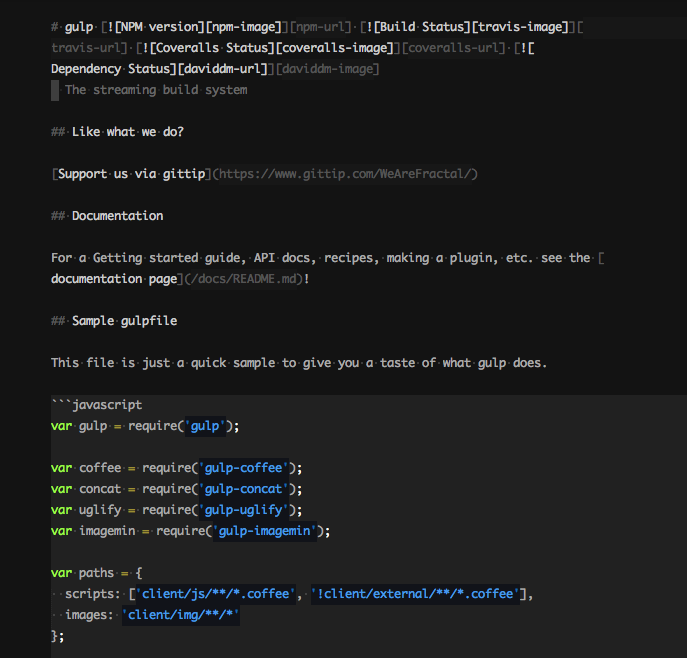
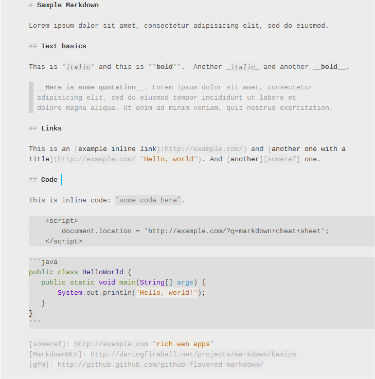
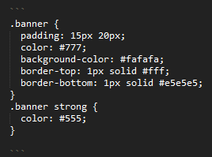
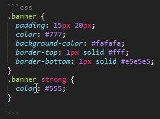

La vie de développeur n'est jamais facile. Tu souhaites faire quelque chose de précis et tu te retrouves à faire totalement autre chose, _patchant_ ci ou tu as découvert ça.

Typiquement, j'étais tranquillement en train d'écrire un article pour **p!** qui n'avait rien à voir avec celui actuel, et je me retrouve à personnaliser mon Sublime Text pour Markdown car ne souhaitant plus utiliser autre chose que celui-ci pour l'écriture.

Il y a certes le très bon [Mou.app](http://mouapp.com/) (`$ brew cask install mou`) sur Mac OS X mais comme indiqué, il n'est que pour Mac, or il m'arrive parfois d'être sur Windows.
De plus, les éditeurs en ligne comme [stackedit.io](https://stackedit.io/) ou [dillinger.io](http://dillinger.io/) sont pratiques mais comme j'ai tendance à stocker mes brouillons sur [dropbox](https://db.tt/nTkiSUb), ces outils vous demandent l'accès de toute votre dropbox, chose que je n'aime pas spécialement.

Bref, tout ça pour dire que tout centraliser sur Sublime Text et utiliser dropbox pour écrire des articles me semble une pratique plutôt agréable.

Pour cela, quittez totalement vos éditeurs Markdown et installez les plugins Sublime Text qui vont bien.

## MarkdownEditing

Premièrement, [MarkdownEditing](http://ttscoff.github.io/MarkdownEditing/), ce petit plugin est votre parfait compagnon qui vous permettra d'avoir la bonne coloration syntaxique de votre Markdown. Il vous permettra de mettre en évidence les liens, le code, et tout le reste. Du bonheur donc.



Oui alors, j'ai fait quelques configurations car à la base, ca ressemble plutôt à ça :



Si vous souhaitez modifier Sublime Text mais uniquement pour le format Markdown, faites : `Preferences > Browse Packages...` puis aller dans `User` et créez un fichier `Markdown.sublime-settings`. Celui-ci sera lu et appliqué à chaque fois que vous éditerez un fichier Markdown.

Voici ce que j'ai pour le moment :

```
{
  "color_scheme": "Packages/MarkdownEditing/MarkdownEditor-Dark.tmTheme",
  "enable_table_editor": true,
  "table_editor_syntax": "Auto",
  "tab_size": 2,
  "extensions":
  [
    "mdown",
    "txt",
    "md"
  ]
}
```

Le thème `dark` pour pas se niquer les yeux (coucou [@bloodyowl](https://twitter.com/bloodyowl)), j'active aussi d'autres plugins dont je vais vous parler d'ici peu, j'affecte le spacing à `2`, et je déclare que j'utiliserai l'éditeur Markdown pour ce genre de fichiers : `.mdown`, `.txt`, `.md`.

Bien, passons à la suite.

## Markdown Preview

Notre cher [@revolunet](https://twitter.com/revolunet) a fait un excellent plugin Markdown pour Sublime Text: [Sublime Text Markdown Preview](https://github.com/revolunet/sublimetext-markdown-preview). Celui-ci permet d'avoir un rendu de votre Markdown en `.html`. Vous pouvez soit compiler votre Markdown pour créer un fichier HTML, soit l'ouvrir directement dans votre navigateur.

Différents formats disponibles :

- Python Markdown
- Github Flavored Markdown

Un autre parfait compagnon en somme, qui quant à lui s'occupera de digérer l'excellent article que vous êtes en train d'écrire.

Je vous parlerai éventuellement un jour de [pandoc](http://johnmacfarlane.net/pandoc/) qui permet de faire ce genre de choses mais en un peu plus complet et générique (Sublime Text n'est pas nécessaire) mais c'est un poil plus complexe. Jettez-y un œil tout de même.

## SmartMarkdown

[Petit plugin](https://github.com/demon386/SmartMarkdown) intéressant qui vous permettra de cacher des parties de votre texte en le repliant. Par exemple, vous vous mettez devant un titre du style `##` et vous appuyez sur `tab`, cela repliera votre texte. Plutôt pratique pour se focaliser.


## SublimeTableEditor

Précédemment dans ma configuration Markdown, vous avez pu voir ceci :

```
  "enable_table_editor": true,
  "table_editor_syntax": "Auto",
```

Cela permet de configurer [SublimeTableEditor](https://github.com/vkocubinsky/SublimeTableEditor) qui vous permettra de correctement aligner vos tableaux dans Markdown.


Et voilà. Avec tout ceci, vous êtes paré(e) à écrire votre Markdown dans de bonnes conditions. Plus qu'à mettre du Jazz et vous préparer une tasse de thé et c'est parti.

## Bonus : Markdown Extended

Il est possible que vous n'aimiez pas forcément MarkdownEditing, et dans ce cas je vous propose un autre plugin pas inintéressant non plus s'appelant [Markdown Extended](https://github.com/jonschlinkert/sublime-markdown-extended). Il vous permettra d'avoir la bonne coloration syntaxique lorsque vous écrivez du code dans votre éditeur.

#### Avant



#### Après




Oh et j'oubliais, voici quelques documentations sur Markdown histoire de bien l'utiliser :

- [Documentation officielle](http://daringfireball.net/projects/markdown/syntax)
- [Markdown Cheatsheet](https://github.com/adam-p/markdown-here/wiki/Markdown-Cheatsheet)
- [Another Markdown Cheatsheet](http://warpedvisions.org/projects/markdown-cheat-sheet.md)
